<div align="center">
<br/>

**Système intelligent de détection des fraudes bancaires en temps réel**  
*Full Stack Web App · Machine Learning · Explainability · REST API*

<br/>

[](https://python.org)
[](https://fastapi.tiangolo.com)
[](https://react.dev)
[](https://postgresql.org)
[](https://docker.com)
[](https://xgboost.readthedocs.io)
[](https://scikit-learn.org)
[](https://tailwindcss.com)
[](https://jwt.io)
[](LICENSE)

<br/>

> 🎓 *Stage d'Initiation – Filière BDCC – ENSET Mohammedia – Université Hassan II de Casablanca*  
> 🏢 *Réalisé au sein de **Vala Orange**, AGADIR · Juillet - Aout 2025*

<br/>

---

### 🏆 Performances du modèle champion — XGBoost + Undersampling

| 🎯 Précision | 📡 Recall | ⚖️ F1-Score | ✅ Exactitude | ⚡ Temps réponse | 🔢 Transactions traitées |
|:-----------:|:---------:|:-----------:|:------------:|:----------------:|:------------------------:|
| **91.6%** | **87.9%** | **89.7%** | **99.97%** | **< 500ms** | **1 277 329** |

---

</div>

## 📌 Table des matières

| # | Section |
|:-:|---------|
| 1 | [🎯 Présentation](#-présentation-du-projet) |
| 2 | [✨ Fonctionnalités](#-fonctionnalités) |
| 3 | [🖼️ Captures d'écran](#️-captures-décran) |
| 4 | [🏗️ Architecture](#️-architecture-du-système) |
| 5 | [🤖 Machine Learning](#-machine-learning) |
| 6 | [🛠️ Stack technologique](#️-stack-technologique) |
| 7 | [📁 Structure du projet](#-structure-du-projet) |
| 8 | [🚀 Installation](#-installation) |
| 9 | [🔌 API REST](#-api-rest) |
| 10 | [🔒 Sécurité](#-sécurité) |
| 11 | [👤 Auteur](#-auteur) |

---

## 🎯 Présentation du projet

**FraudGuard** est une application web Full Stack complète dédiée à la **détection intelligente des fraudes bancaires**. Elle combine un pipeline de Machine Learning avancé avec une interface web moderne pour permettre aux équipes bancaires d'analyser des transactions en temps réel et par lot.

### Le problème

```
💸 Fraudes bancaires mondiales    → Des milliards de dollars de pertes chaque année
📊 Déséquilibre des données      → Seulement ~1% de transactions frauduleuses
⚡ Besoin de rapidité            → Détection en temps réel indispensable
🧠 Besoin d'explicabilité        → Comprendre POURQUOI une transaction est suspecte
```

### La solution FraudGuard

```
✅ Modèle XGBoost           → 91.6% de précision, 87.9% de recall
✅ Technique Undersampling   → Gestion optimale du déséquilibre de classes
✅ Explications SHAP         → Facteurs d'impact détaillés par transaction
✅ Interface React.js        → Dashboard intuitif et responsive
✅ API FastAPI sécurisée     → JWT + bcrypt + validation Pydantic
✅ Déploiement Docker        → Portabilité et reproductibilité garanties
```

---

## ✨ Fonctionnalités

<table>
<tr>
<td width="50%" valign="top">

### 👤 Utilisateur
- 🔐 Connexion sécurisée (JWT)
- 📊 Dashboard avec statistiques temps réel
- 🔍 Prédiction unitaire via formulaire guidé
- 📁 Analyse par lot — import CSV (max 10 Mo)
- 📈 Résultats détaillés + facteurs SHAP
- 📤 Export des résultats (CSV / PDF)
- 🗂️ Historique des transactions analysées

</td>
<td width="50%" valign="top">

### 🛡️ Administrateur
- 👥 Gestion complète des utilisateurs
- 🤖 Administration des modèles IA
- 📋 Supervision de toutes les transactions
- 📉 Comparaison des métriques inter-modèles
- 📦 Téléchargement et activation des modèles
- 🔬 Matrice de confusion & radar de perf
- ⚙️ Paramétrage du système

</td>
</tr>
</table>

---

## 🖼️ Captures d'écran

### 🏠 Page d'accueil

Interface publique avant authentification — métriques clés, call-to-action et présentation des fonctionnalités.


---

### 🔐 Connexion sécurisée

Authentification JWT — conforme aux standards bancaires. Plateforme sécurisée avec politique de confidentialité intégrée.


---

### 📊 Tableau de bord

Vue d'ensemble en temps réel : compteurs de transactions, taux de fraude, courbe d'évolution sur 14 jours, répartition des fraudes par type (donut chart).

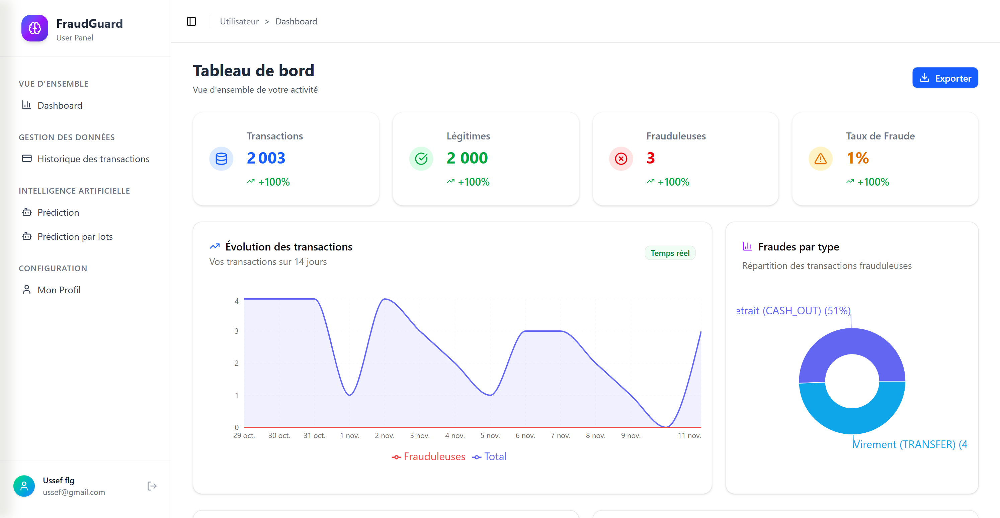

---

### 🔍 Formulaire de prédiction

Saisie guidée des détails d'une transaction — sélection du modèle IA (91.6% de précision), type de transaction, montant, soldes des comptes origine et destination.

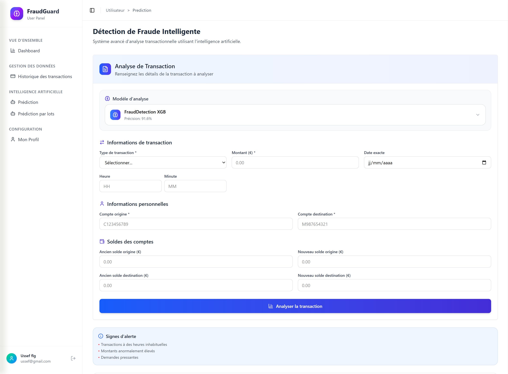

---

### ✅ Résultat d'une prédiction

Verdict clair avec badge coloré, score de confiance à 97.6%, recommandation **AUTORISER / BLOQUER** et détail des **facteurs SHAP** ayant influencé la décision.

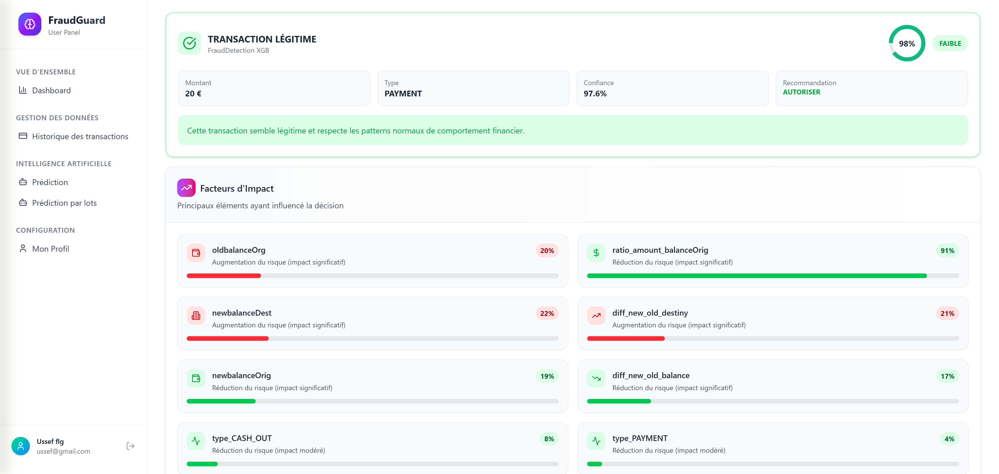

---

### 📁 Analyse par lot — Upload CSV

Interface d'upload de fichier CSV (max 10 Mo) avec sélection du modèle d'analyse et conseils d'upload intégrés.

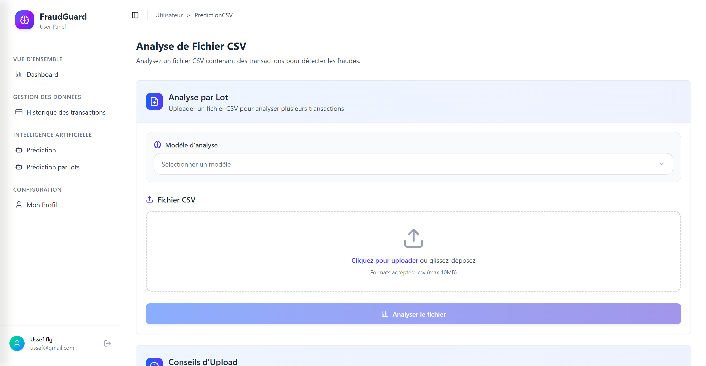

---

### 📈 Résultats d'analyse CSV

Dashboard complet après analyse par lot : total, légitimes, frauduleuses, niveau de risque global, répartition par type, plages de montants, évolution temporelle.

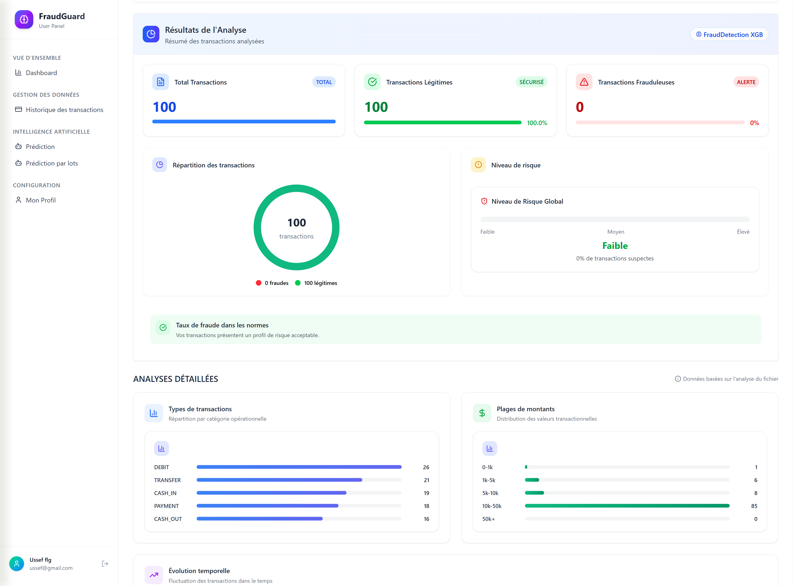

---

### 🤖 Administration des modèles IA

Vue admin — liste des modèles avec métriques Précision/Recall/F1, état du système (Opérationnel / API disponible), transactions traitées.

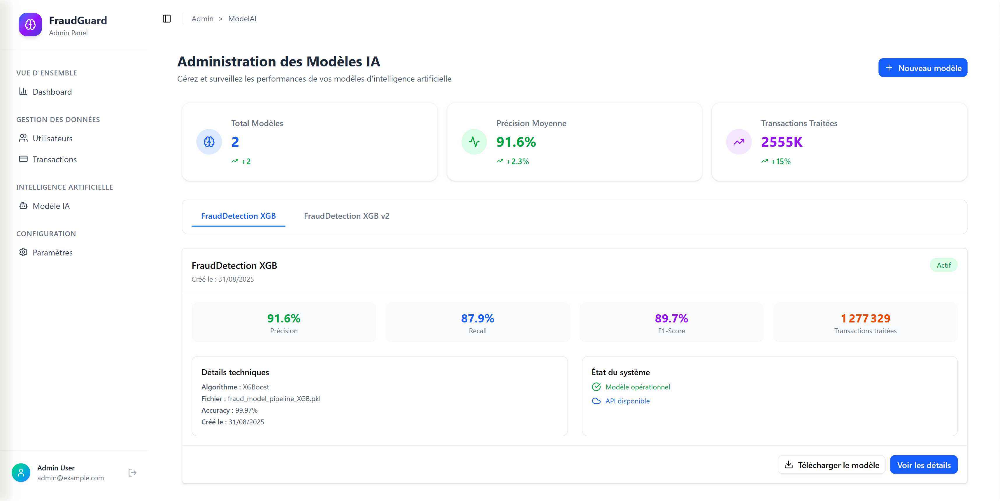

---

### 🔬 Détail d'un modèle IA

Fiche complète : métriques détaillées, graphique de comparaison en barres, radar de performance global (Précision / Rappel / F1-Score / Exactitude), matrice de confusion.

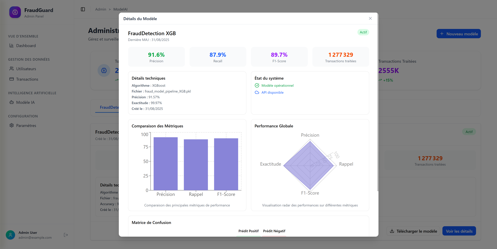

---

### ⚡ Test API avec Postman

Démonstration de l'endpoint `POST /transactions/predict` avec corps JSON et réponse `200 OK` contenant `prediction`, `probability` et `influencing_factors`.

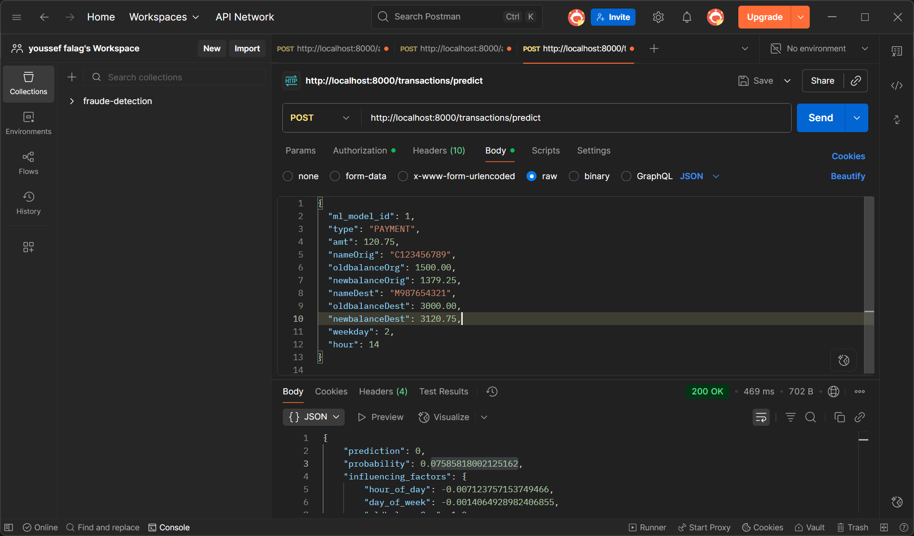

---
---

## 🏗️ Architecture du système

### Vue d'ensemble 3-tiers

<div align="center">
  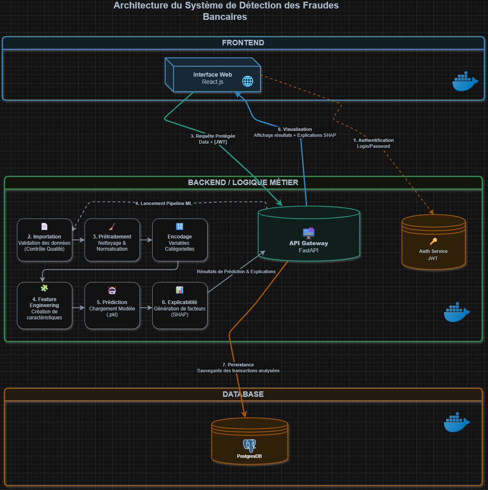
</div>

---

### Flux de traitement en 8 étapes

| Étape | Action | Détail |
|:-----:|--------|--------|
| 1️⃣ | **Authentification** | Vérification identifiants + génération token JWT |
| 2️⃣ | **Importation** | Validation CSV, parsing, contrôle qualité des données |
| 3️⃣ | **Prétraitement** | Nettoyage, normalisation des variables numériques |
| 4️⃣ | **Feature Engineering** | Création de nouvelles caractéristiques pertinentes |
| 5️⃣ | **Prédiction** | Chargement `.pkl`, calcul probabilité de fraude |
| 6️⃣ | **Explicabilité** | Génération des facteurs SHAP influençant la décision |
| 7️⃣ | **Persistance** | Sauvegarde PostgreSQL pour traçabilité et audit |
| 8️⃣ | **Visualisation** | Affichage résultats, graphiques interactifs, export |

### Diagramme de séquence — Prédiction unitaire

<div align="center">
  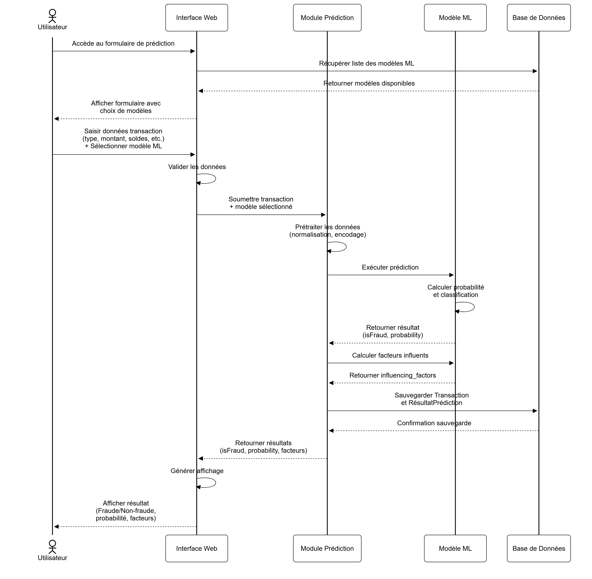
</div>

---

### Modélisation des données

<div align="center">
  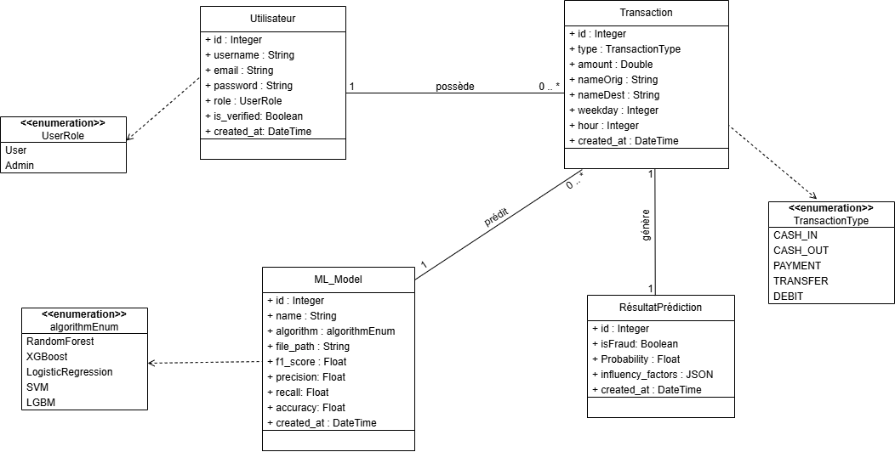
</div>


---

## 🤖 Machine Learning

### Le jeu de données

| Caractéristique | Détail |
|----------------|--------|
| **Source** | Kaggle — Synthetic Financial Dataset |
| **Volume total** | ~50 000 transactions |
| **Transactions normales** | ~49 200 (≈98%) |
| **Transactions frauduleuses** | ~800 (≈1.6%) |
| **Types** | TRANSFER, CASH_IN, PAYMENT, DEBIT, CASH_OUT |
| **Plage de montants** | 0 → 10 000 (distribution quasi-uniforme) |
| **Fraudes concentrées sur** | TRANSFER et CASH_OUT uniquement |

### Features utilisées

```python
# Features brutes
features_brutes = [
    'type',              # Type de transaction (encodé OneHot)
    'amount',            # Montant de la transaction
    'oldbalanceOrg',     # Ancien solde du compte origine
    'newbalanceOrig',    # Nouveau solde du compte origine
    'oldbalanceDest',    # Ancien solde du compte destination
    'newbalanceDest',    # Nouveau solde du compte destination
    'weekday',           # Jour de la semaine (0–6)
    'hour',              # Heure de la transaction (0–23)
]

# Features engineered (créées pour améliorer la performance)
features_engineered = [
    'ratio_amount_balanceOrig',   # Ratio montant / solde origine
    'diff_new_old_balance',       # Δ solde compte origine
    'diff_new_old_destiny',       # Δ solde compte destination
]
```

### Pipeline complet

```python
from sklearn.pipeline import Pipeline
from sklearn.preprocessing import StandardScaler, OneHotEncoder
from sklearn.compose import ColumnTransformer
from xgboost import XGBClassifier

pipeline = Pipeline([
    ('preprocessor', ColumnTransformer([
        ('num', StandardScaler(), numerical_features),
        ('cat', OneHotEncoder(handle_unknown='ignore'), ['type'])
    ])),
    ('classifier', XGBClassifier(
        n_estimators=200,
        max_depth=6,
        learning_rate=0.1,
        use_label_encoder=False,
        eval_metric='logloss',
        random_state=42
    ))
])
```

### Gestion du déséquilibre des classes

```
Distribution réelle :
  Normal      ████████████████████████████████████████████  ~49 200 (98%)
  Frauduleuse ██                                              ~800  ( 2%)

Techniques comparées :
  ┌─────────────────────┬──────────┬───────────┬──────────────────┐
  │ Algorithme          │ Sans éq. │ SMOTE     │ Undersampling    │
  ├─────────────────────┼──────────┼───────────┼──────────────────┤
  │ Régression Log.     │  0.58    │   0.79    │   0.83           │
  │ Random Forest       │  0.71    │   0.91    │   0.93           │
  │ XGBoost             │  0.75    │   0.94    │   0.95  ← ✅     │
  └─────────────────────┴──────────┴───────────┴──────────────────┘

→ XGBoost + Undersampling retenu : meilleur recall pour la détection de fraudes
```

### Métriques du modèle déployé

```
╔══════════════════════════════════════════════════════════════════╗
║           FraudDetection XGB  ·  fraud_model_pipeline_XGB.pkl   ║
╠══════════════════════════════════════════════════════════════════╣
║  Précision    ██████████████████████████████░░  91.6%           ║
║  Recall       ████████████████████████████░░░░  87.9%           ║
║  F1-Score     █████████████████████████████░░░  89.7%           ║
║  Exactitude   ████████████████████████████████  99.97%          ║
╠══════════════════════════════════════════════════════════════════╣
║  Transactions traitées  :  1 277 329                             ║
║  Dernière mise à jour   :  31/08/2025                            ║
║  Statut                 :  ✅ Opérationnel  ·  🟢 API dispo      ║
╚══════════════════════════════════════════════════════════════════╝
```

### Explicabilité — SHAP Values

Chaque prédiction retourne les facteurs ayant le plus influencé la décision du modèle :

```json
{
  "prediction": 0,
  "probability": 0.076,
  "confidence": 97.6,
  "recommendation": "AUTORISER",
  "influencing_factors": {
    "ratio_amount_balanceOrig": 0.91,    // 🟢 Réduit le risque  (91%)
    "newbalanceDest":           0.22,    // 🔴 Augmente le risque (22%)
    "diff_new_old_destiny":     0.21,    // 🔴 Augmente le risque (21%)
    "oldbalanceOrg":            0.20,    // 🔴 Augmente le risque (20%)
    "newbalanceOrig":           0.19,    // 🟢 Réduit le risque  (19%)
    "diff_new_old_balance":     0.17,    // 🟢 Réduit le risque  (17%)
    "type_CASH_OUT":            0.08,    // 🟢 Réduit le risque  ( 8%)
    "type_PAYMENT":             0.04     // 🟢 Réduit le risque  ( 4%)
  }
}
```

---

## 🛠️ Stack technologique

<table>
<tr>
<th>Couche</th>
<th>Technologie</th>
<th>Version</th>
<th>Rôle</th>
</tr>
<tr>
<td rowspan="4"><b>🎨 Frontend</b><br/><i>JavaScript 87%</i></td>
<td>React.js</td>
<td>18+</td>
<td>SPA, composants réutilisables, routing</td>
</tr>
<tr>
<td>TailwindCSS</td>
<td>3+</td>
<td>Design system moderne, responsive</td>
</tr>
<tr>
<td>Chart.js</td>
<td>4+</td>
<td>Graphiques interactifs, donuts, courbes</td>
</tr>
<tr>
<td>Axios</td>
<td>1+</td>
<td>Requêtes HTTP vers l'API REST</td>
</tr>
<tr>
<td rowspan="4"><b>⚡ Backend</b><br/><i>Python 9.1%</i></td>
<td>FastAPI</td>
<td>0.100+</td>
<td>API REST haute perf + Swagger automatique</td>
</tr>
<tr>
<td>SQLAlchemy</td>
<td>2+</td>
<td>ORM Python pour PostgreSQL</td>
</tr>
<tr>
<td>Pydantic</td>
<td>2+</td>
<td>Validation et sérialisation des données</td>
</tr>
<tr>
<td>JWT + bcrypt</td>
<td>—</td>
<td>Auth sécurisée + hachage mots de passe</td>
</tr>
<tr>
<td rowspan="5"><b>🤖 Machine Learning</b></td>
<td>XGBoost</td>
<td>1.7+</td>
<td>Algorithme de classification principal</td>
</tr>
<tr>
<td>Scikit-learn</td>
<td>1.3+</td>
<td>Pipeline, preprocessing, évaluation</td>
</tr>
<tr>
<td>Pandas / NumPy</td>
<td>—</td>
<td>Manipulation et analyse des données</td>
</tr>
<tr>
<td>Imbalanced-learn</td>
<td>—</td>
<td>SMOTE et Undersampling</td>
</tr>
<tr>
<td>Joblib</td>
<td>—</td>
<td>Sérialisation du modèle (.pkl)</td>
</tr>
<tr>
<td rowspan="3"><b>🗄️ Infrastructure</b></td>
<td>PostgreSQL</td>
<td>15+</td>
<td>Base de données relationnelle</td>
</tr>
<tr>
<td>Docker Compose</td>
<td>v2</td>
<td>Orchestration des 3 conteneurs</td>
</tr>
<tr>
<td>Git / GitHub</td>
<td>—</td>
<td>Versioning et suivi du projet</td>
</tr>
</table>

---

## 📁 Structure du projet

```
detection-fraude/                       ← Repo GitHub
│
├── 📁 backend-app/                     # API FastAPI — Python 9.1%
│   ├── app/
│   │   ├── main.py                    # Point d'entrée + config CORS
│   │   ├── models.py                  # Entités SQLAlchemy
│   │   │                              #   User · Transaction · ML_Model · RésultatPrédiction
│   │   ├── schemas.py                 # Schémas de validation Pydantic
│   │   ├── database.py                # Connexion PostgreSQL (SQLAlchemy)
│   │   ├── routes/
│   │   │   ├── auth.py                # POST /auth/login · /auth/register · GET /auth/me
│   │   │   ├── transactions.py        # POST /transactions/predict · /predict/csv
│   │   │   └── users.py               # CRUD /users/ (Admin)
│   │   └── services/
│   │       ├── ml_service.py          # Chargement .pkl + inférence XGBoost
│   │       ├── preprocessing.py       # Nettoyage · normalisation · encoding
│   │       └── shap_service.py        # Calcul et formatage des SHAP values
│   ├── models/
│   │   └── fraud_model_pipeline_XGB.pkl   # ← Modèle XGBoost entraîné (sérialisé)
│   ├── requirements.txt
│   └── Dockerfile
│
├── 📁 frontend-app/                    # Application React — JavaScript 87% · CSS 3.4%
│   ├── src/
│   │   ├── components/
│   │   │   ├── Navbar.jsx
│   │   │   ├── Sidebar.jsx
│   │   │   └── charts/               # Composants Chart.js réutilisables
│   │   ├── pages/
│   │   │   ├── HomePage.jsx           # Landing page publique
│   │   │   ├── Login.jsx              # Authentification JWT
│   │   │   ├── Register.jsx
│   │   │   ├── Dashboard.jsx          # Tableau de bord principal
│   │   │   ├── Prediction.jsx         # Formulaire prédiction unitaire
│   │   │   ├── PredictionCSV.jsx      # Upload & analyse par lot CSV
│   │   │   ├── TransactionHistory.jsx # Historique des transactions
│   │   │   └── admin/
│   │   │       ├── ModelAdmin.jsx     # Gestion et monitoring modèles IA
│   │   │       └── UserManagement.jsx # Gestion des utilisateurs
│   │   ├── services/
│   │   │   └── api.js                 # Appels Axios centralisés
│   │   └── context/
│   │       └── AuthContext.jsx        # JWT + état utilisateur global (Context API)
│   ├── package.json
│   └── Dockerfile
│
├── 📁 screenshots/                     # ← Ajouter ce dossier avec les captures d'écran
│   ├── ui_homepage.png
│   ├── ui_loginpage.png
│   ├── ui_dashboard.png
│   ├── ui_prediction_form.png
│   ├── ui_prediction_result_form.png
│   ├── ui_prediction.png
│   ├── ui_prediction_result_csv.png
│   ├── ui_models_admin.png
│   ├── ui_model_admin.png
│   └── ui_postman.png
│
├── docker-compose.yml                  # Orchestration des 3 services (frontend · backend · db)
├── .env.example                        # Template des variables d'environnement
├── .gitattributes
└── README.md
```

---

## 🚀 Installation

### Prérequis

```bash
docker --version          # Docker 20.10+
docker compose version    # Docker Compose v2+
git --version             # Git 2+
```

### ⚡ Démarrage rapide avec Docker (recommandé)

```bash
# 1. Cloner le dépôt
git clone https://github.com/yousseffalag/detection-fraude.git
cd detection-fraude

# 2. Configurer les variables d'environnement
cp .env.example .env
# → Éditez .env avec vos valeurs

# 3. Lancer tous les services d'un coup
docker compose up --build
```

**Services disponibles :**

| Service | URL | Description |
|---------|-----|-------------|
| 🌐 Frontend | http://localhost:3000 | Interface React.js |
| ⚡ API | http://localhost:8000 | FastAPI backend |
| 📚 Swagger | http://localhost:8000/docs | Documentation interactive |
| 🗄️ PostgreSQL | localhost:5432 | Base de données |

### 🔧 Variables d'environnement `.env`

```env
# ── Base de données ──────────────────────────────────
POSTGRES_USER=fraudguard
POSTGRES_PASSWORD=change_me_in_production
POSTGRES_DB=fraudguard_db
DATABASE_URL=postgresql://fraudguard:change_me_in_production@db:5432/fraudguard_db

# ── Sécurité JWT ─────────────────────────────────────
SECRET_KEY=your-super-secret-key-minimum-32-characters
ALGORITHM=HS256
ACCESS_TOKEN_EXPIRE_MINUTES=30

# ── API ──────────────────────────────────────────────
API_HOST=0.0.0.0
API_PORT=8000
CORS_ORIGINS=http://localhost:3000

# ── Frontend ─────────────────────────────────────────
REACT_APP_API_URL=http://localhost:8000
```

### 🛠️ Mode développement local (sans Docker)

<details>
<summary><b>▶ Backend — FastAPI</b></summary>

```bash
cd backend-app
python -m venv venv
source venv/bin/activate        # Windows : venv\Scripts\activate
pip install -r requirements.txt

# Appliquer les migrations de base de données
alembic upgrade head

# Démarrer le serveur en mode rechargement automatique
uvicorn app.main:app --reload --host 0.0.0.0 --port 8000
# → API disponible sur http://localhost:8000
# → Swagger UI sur http://localhost:8000/docs
```
</details>

<details>
<summary><b>▶ Frontend — React</b></summary>

```bash
cd frontend-app
npm install
npm start
# → Application disponible sur http://localhost:3000
```
</details>

<details>
<summary><b>▶ Exploration ML — Notebooks Jupyter</b></summary>

```bash
pip install jupyter pandas numpy scikit-learn xgboost \
            imbalanced-learn seaborn plotly joblib
jupyter notebook
# Ouvrir les notebooks dans l'ordre : 01_ → 02_ → 03_ → 04_
```
</details>

---

## 🔌 API REST

Documentation interactive complète disponible sur **http://localhost:8000/docs** (Swagger UI généré automatiquement par FastAPI).

### Endpoints

```
🔐 AUTHENTIFICATION
  POST  /auth/register              → Créer un compte utilisateur
  POST  /auth/login                 → Connexion + retour token JWT
  GET   /auth/me                    → Profil de l'utilisateur connecté

🧠 PRÉDICTION
  POST  /transactions/predict       → Prédire une transaction unique (JSON)
  POST  /transactions/predict/csv   → Analyser un fichier CSV par lot
  GET   /transactions/              → Historique des transactions de l'utilisateur
  GET   /transactions/stats         → Statistiques globales du compte

👑 ADMINISTRATION  (JWT Admin requis)
  GET    /users/                    → Liste tous les utilisateurs
  POST   /users/                    → Créer un nouvel utilisateur
  PATCH  /users/{id}                → Modifier un utilisateur
  DELETE /users/{id}                → Supprimer un utilisateur
  GET    /models/                   → Liste des modèles ML disponibles
  POST   /models/                   → Enregistrer un nouveau modèle ML
```

### Exemple complet — Prédiction unitaire

**Requête :**
```bash
curl -X POST http://localhost:8000/transactions/predict \
  -H "Content-Type: application/json" \
  -H "Authorization: Bearer <votre_token_jwt>" \
  -d '{
    "ml_model_id": 1,
    "type": "PAYMENT",
    "amt": 120.75,
    "nameOrig": "C123456789",
    "oldbalanceOrg": 1500.00,
    "newbalanceOrig": 1379.25,
    "nameDest": "M987654321",
    "oldbalanceDest": 3000.00,
    "newbalanceDest": 3120.75,
    "weekday": 2,
    "hour": 14
  }'
```

**Réponse `200 OK` :**
```json
{
  "prediction": 0,
  "is_fraud": false,
  "probability": 0.07585818002125162,
  "confidence": 97.6,
  "recommendation": "AUTORISER",
  "risk_level": "FAIBLE",
  "influencing_factors": {
    "ratio_amount_balanceOrig": 0.91,
    "newbalanceDest": 0.22,
    "diff_new_old_destiny": 0.21,
    "oldbalanceOrg": 0.20,
    "newbalanceOrig": 0.19,
    "diff_new_old_balance": 0.17,
    "type_CASH_OUT": 0.08,
    "type_PAYMENT": 0.04
  }
}
```

### Format CSV attendu

```csv
type,amount,nameOrig,oldbalanceOrg,newbalanceOrig,nameDest,oldbalanceDest,newbalanceDest,weekday,hour
PAYMENT,120.75,C123456789,1500.00,1379.25,M987654321,3000.00,3120.75,2,14
TRANSFER,5000.00,C987654321,6000.00,1000.00,C111222333,0.00,5000.00,5,23
CASH_OUT,800.00,C555444333,900.00,100.00,C999888777,200.00,1000.00,0,3
```

> **Colonnes obligatoires :** `type` · `amount` · `nameOrig` · `oldbalanceOrg` · `newbalanceOrig` · `nameDest` · `oldbalanceDest` · `newbalanceDest` · `weekday` · `hour`

---

## 🔒 Sécurité

| Mécanisme | Bibliothèque | Description |
|-----------|-------------|-------------|
| **JWT** | `python-jose` | Tokens stateless avec expiration configurable |
| **bcrypt** | `passlib[bcrypt]` | Hachage adaptatif des mots de passe (coût ajustable) |
| **Validation** | `Pydantic v2` | Rejet automatique des entrées malformées avant traitement |
| **CORS** | FastAPI middleware | Seules les origines whitelistées peuvent accéder à l'API |
| **RBAC** | Décorateurs FastAPI | Séparation stricte des droits `User` / `Admin` |
| **HTTPS** | Nginx + Docker | Chiffrement TLS en transit (configuration production) |

---

## 🎓 Contexte académique

| Élément | Détail |
|---------|--------|
| 🎓 **Établissement** | ENSET Mohammedia — Université Hassan II de Casablanca |
| 📚 **Filière** | BDCC (Big Data & Cloud Computing) |
| 🏢 **Entreprise d'accueil** | Vala Orange — Immeuble Safwa, Boulevard Hassan 1er, Dakhla |
| 👨‍💼 **Encadrant entreprise** | M. Neuman Charhbili — Développeur SEO |
| 📅 **Période de stage** | 20/07/2025 – 30/08/2025 |
| 📄 **Type de stage** | Stage d'Initiation |
| 🗓️ **Année universitaire** | 2024–2025 |

---

## 👤 Auteur

<div align="center">

### FALAG Youssef

*Étudiant BDCC · ENSET Mohammedia ·*


---

<sub>

Si ce projet vous a été utile, n'hésitez pas à lui donner une ⭐ !

**[detection-fraude](https://github.com/yousseffalag/detection-fraude)** — *Détectez les fraudes avant qu'elles n'impactent vos finances* 🛡️

*Stage d'Initiation 2025*

</sub>

</div>
